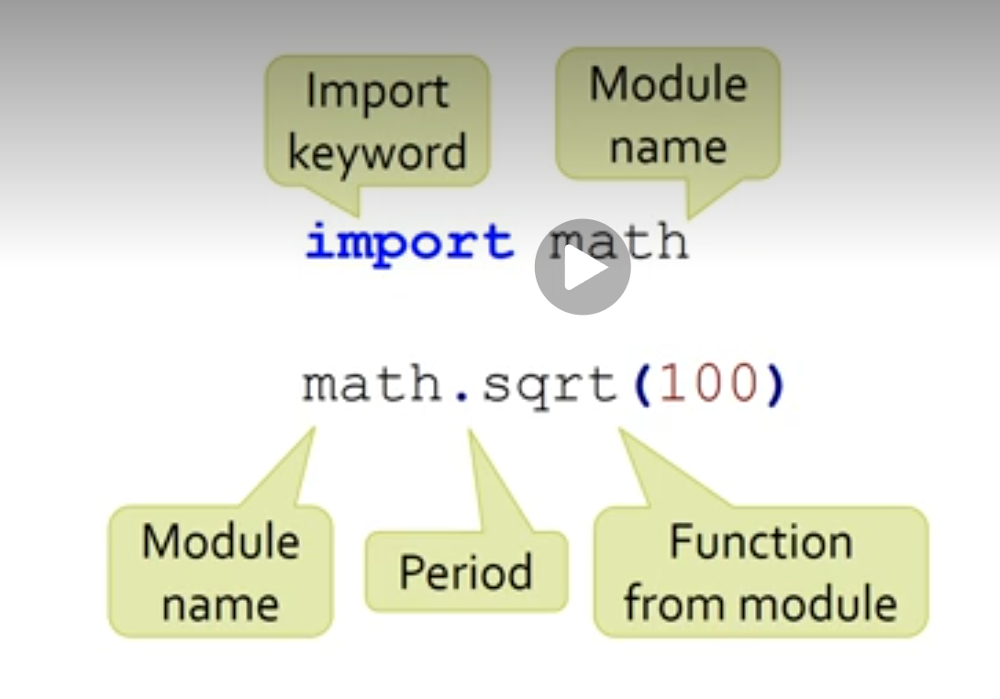
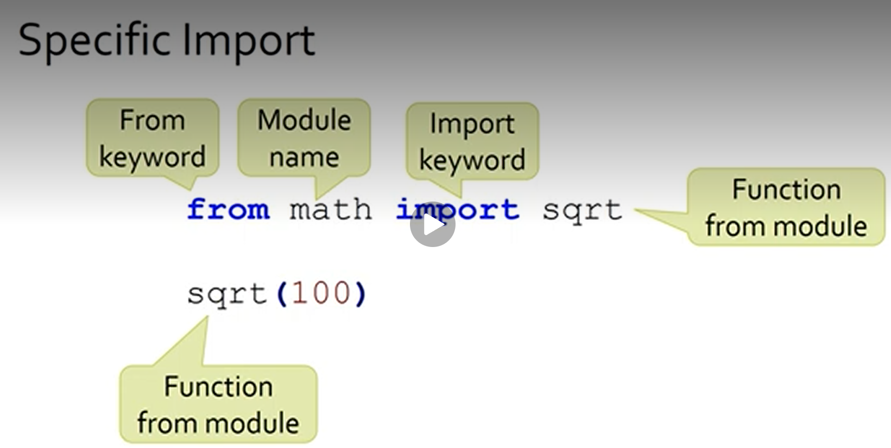
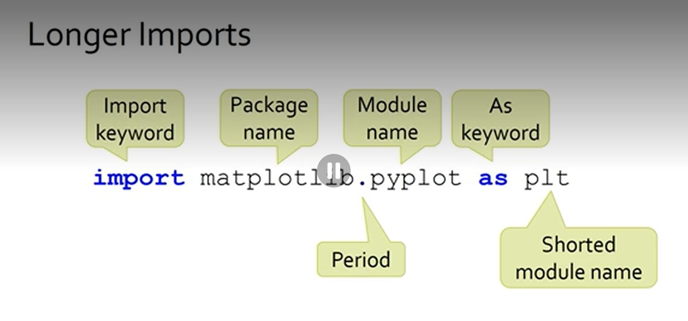
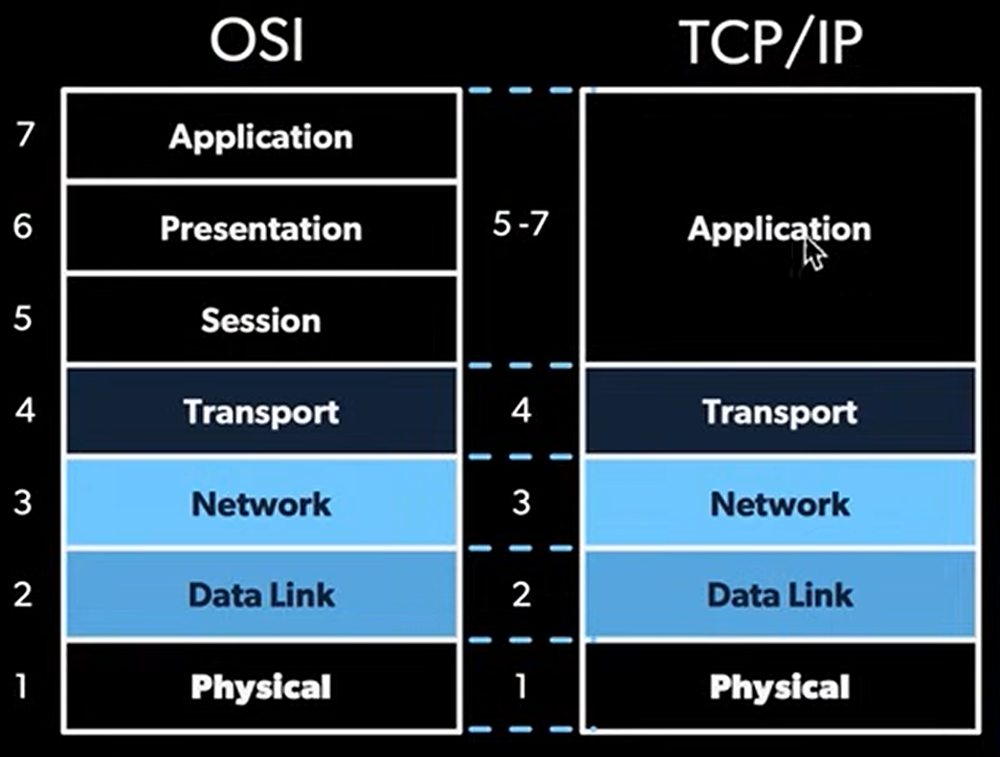

# Python Programming Class Notes

# Week 2 Notes

Most common pen testing coding languages:
- python 
- bash
- c
- ruby
- perl


Learn these well!
- **NMAP**
Nmap ("Network Mapper") is a free and open-source utility for network discovery and security auditing. Please visit NMAP Links to an external site.for their documentation and further reading. NMAP can be found in Kali. We will discuss NMAP later in the course. 

- **Metasploit**
Metasploit and Metasploit project provides information about security vulnerabilities and aids in penetration testing and IDS signature development. It is owned by Rapid7. 

- **Kali Linux**
  Kali Linux is an open-source Linux distribution aimed at Penetration testing and Security Auditing. Kali has lots of useful ethical hacking and penetration testing tools. 
  - [Tools](https://www.kali.org/tools/#:~:text=Kali%20Linux%20Tools%20Listing)  pre-built or easily downloadable in Kali Linux.

## Setting up Kali 

- downlaoded official vbox zip file from kali website and extracted it to a c/users/ojeda didn't work and then I extracted the files in downloads and it worked... **why?** 
## Python review 

### General concepts discussed: Functions, naming conventions, classes and objects, 

```python 
# Example
cars = ["toyota", "ford", "gm", "tesla", "vw"]

print(cars[0])

for x in cars:
  print(x)
  if x == "gm":
    break

```

**output:**
toyota
toyota
ford
gm

### Syntax Doc
[PEP8](https://www.python.org/dev/peps/pep-0008/)

- function naming convention should be first word undercase, underscore, then >>> uppercase
- logic and obviously descriptive names 

Ex: 

```python
# Function
def get_Name():
    name = input("Hello what is your name? ")
    print(name)

get_Name()
```

## Classes and Objects 

### Examples of Objects: lists, dictionary, and file 

```python
# List Object 
new_list = []
new_list.append(5)

# Dictionary Object 
new_dictionary = {}
new_dictionary["Name"] = "Natalia"

# File Object 
new_file = open("file_name.txt")
new_file.close()

```

- An object has properties and methods where a class is the it's blueprint
  - so when creating a class, you define the properties and methods you'd like the object to have
- NOTICE: syntax of class names is uppercase... no underscores
  
**Simple Class Ex:**
```python
# Example of a class with one static property 

class MyClass:

  x = 5


p1 = MyClass()
p2 = MyClass()
p3 = MyClass()

print(p1.x)
print(p2.x)
print(p3.x)
```

- The class could have dynamic variables (instance specific data) meaning you define a general property, then when you create an object of that class, you define what you want that specific object's property to be. 

**Complete Ex:**
```python
    class Person:
        species = "Homo sapiens"  # Class variable
        
        # Constructor 
        def __init__(self, name, age):
            self.name = name      # Instance attributes
            self.age = age
        
        def introduce(self):
            return f"Hi, I'm {self.name}, {self.age} years old."
        
        def have_birthday(self):
            self.age += 1         # Modifying instance attribute
            return f"Happy birthday! Now {self.age}!"

    # Creating objects
    alice = Person("Alice", 25)
    bob = Person("Bob", 30)

    print(alice.introduce())      # Hi, I'm Alice, 25 years old.
    print(bob.have_birthday())    # Happy birthday! Now 31!

```

- what is a **constructor**?
  - runs when creating an object, sets up initial state
  - do ot have to reference self when creatign an object (done automatically in the background)
- what is **self**?
  - reference to the specific instance, needed for instance-specific data

## Python Modules 

Definition -> Modules = python programs = Library = Package 

### Import libraries 

Different ways to import libraries:

**1** - simplest but imports everything and you must specify which function you'd like to use EVERY time. 


You only need one specific function?
**2** - specify the function in the import.



**3** - specify the file and rename it to something shorter. 


### Install Libraries 
- you might have to install libraries before importing modules 
  - how? **pip install** _________

## OSI vs TCP/IP Model 



OSI - Memorize 
**Top to Bottom!**
All People Seem To Need Data Processing

**Bottom to TOP!**
Please Do Not Throw Sausage Pizza Away

OSI Buckets 
**Top 3** 
**Middle**
**Bottom #** 