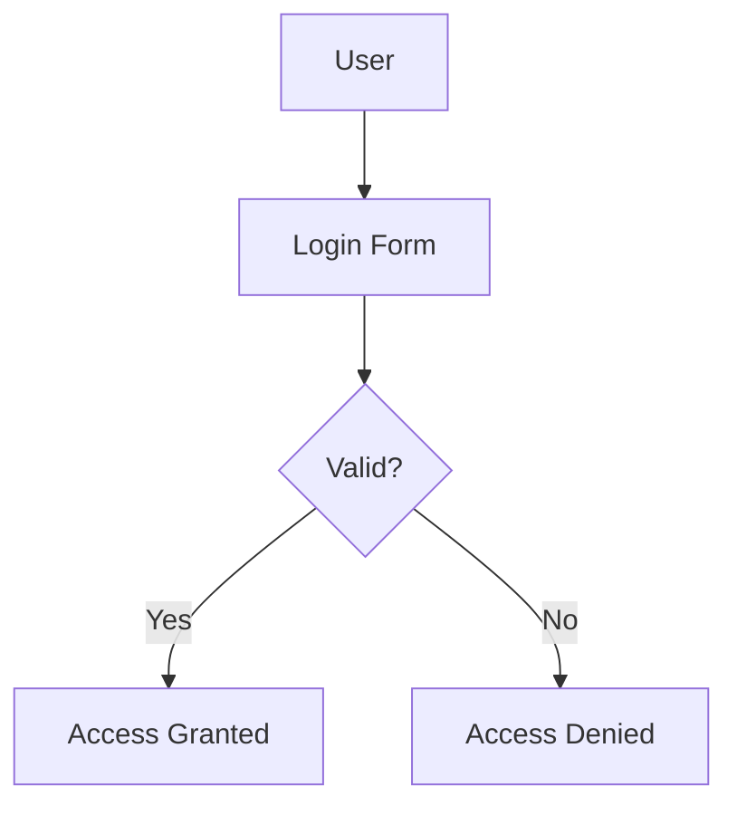

# 🧠 Markdown Cheat Sheet — Hybrid (Syntax + Rendered Example)

---

## ✨ 1. Headings

**Syntax:**
```markdown
# H1 – Main title
## H2 – Section
### H3 – Subsection
#### H4 – Sub-subsection
```

**Rendered:**
# H1 – Main title
## H2 – Section
### H3 – Subsection
#### H4 – Sub-subsection

---

## 💬 2. Emphasis

**Syntax:**
```markdown
*italic* or _italic_
**bold** or __bold__
***bold italic***
~~strikethrough~~
```

**Rendered:**
*italic* or _italic_  
**bold** or __bold__  
***bold italic***  
~~strikethrough~~

---

## 📋 3. Lists

**Syntax:**
```markdown
- Item 1
- Item 2
  - Sub-item

1. First
2. Second
   1. Nested
```

**Rendered:**

- Item 1
- Item 2
  - Sub-item

1. First
2. Second
   1. Nested

---

## 🔗 4. Links and Images

**Syntax:**
```markdown
[OpenAI](https://openai.com)

```

**Rendered:**
[OpenAI](https://openai.com)  


---

## 🧾 5. Code & Syntax Highlighting

**Syntax:**
````markdown
Use \`git status\` to check your repo.

```python
def hello():
    print("Hello, world!")
```
````

**Rendered:**

Use `git status` to check your repo.

```python
def hello():
    print("Hello, world!")
```

---

## 📦 6. Blockquotes

**Syntax:**
```markdown
> This is a quote.
> Use for notes, highlights, or definitions.
```

**Rendered:**
> This is a quote.  
> Use for notes, highlights, or definitions.

---

## 📊 7. Tables

**Syntax:**
```markdown
| Header 1 | Header 2 | Header 3 |
|-----------|-----------|-----------|
| Row 1     | Data A    | Data B    |
| Row 2     | Data C    | Data D    |
```

**Rendered:**

| Header 1 | Header 2 | Header 3 |
|-----------|-----------|-----------|
| Row 1     | Data A    | Data B    |
| Row 2     | Data C    | Data D    |

---

## 🧩 8. Horizontal Rule

**Syntax:**
```markdown
---
```

**Rendered:**
---

---

## 🧮 9. Checkboxes / To-do Lists

**Syntax:**
```markdown
- [x] Completed task
- [ ] Pending task
```

**Rendered:**
- [x] Completed task
- [ ] Pending task

---

## 🧠 10. Diagrams (Mermaid syntax)

**Syntax:**
````markdown

````

**Rendered:**


---

## 🧾 11. Footnotes

**Syntax:**
```markdown
Here’s a fact[^1].

[^1]: Footnote text goes here.
```

**Rendered:**

Here’s a fact[^1].

[^1]: Footnote text goes here.

---

## 🧱 12. Collapsible Sections

**Syntax:**
```markdown
<details>
<summary>Click to expand</summary>

Hidden content here — useful for code snippets or notes.

</details>
```

**Rendered:**

<details>
<summary>Click to expand</summary>

Hidden content here — useful for code snippets or notes.

</details>

---

## 🧮 13. Math / LaTeX (if supported)

**Syntax:**
```markdown
Inline: $E = mc^2$
Block:
$$
P(E) = \frac{\text{favorable outcomes}}{\text{total outcomes}}
$$
```

**Rendered:**

Inline: $E = mc^2$  
Block:

$$ 
P(E) = \frac{\text{favorable outcomes}}{\text{total outcomes}}
$$

---

## 🗂️ 14. YAML Front Matter (Metadata)

**Syntax:**
```markdown
---
title: "Network Security Basics"
course: "MIS 522"
tags: [security, networking, CIA]
date: 2025-11-06
---
```

**Rendered:**

---
title: "Network Security Basics"  
course: "MIS 522"  
tags: [security, networking, CIA]  
date: 2025-11-06  
---

---
d